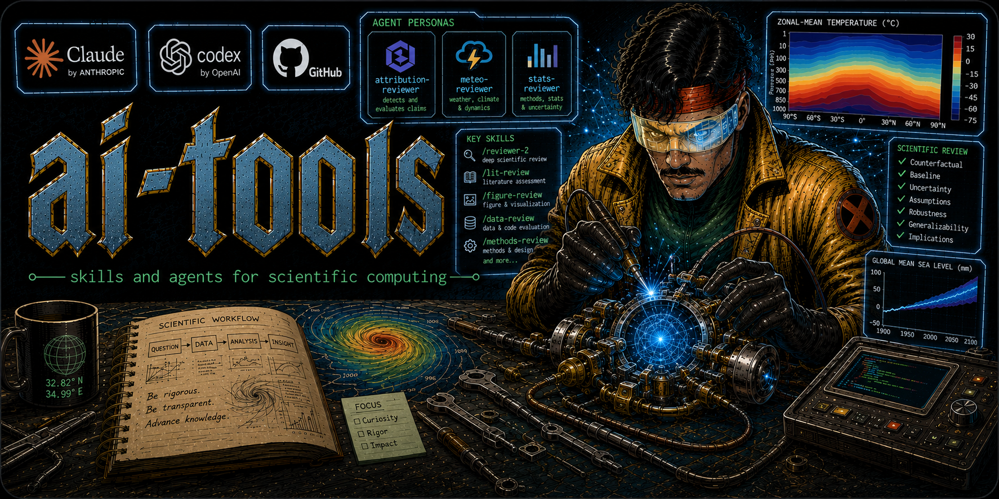

# ai-tools

Global Claude Code skills and agent personas for scientific computing workflows.

## Agents

Subagent personas live in `agents/` and are deployed to `~/.claude/agents/`. Each adopts a domain-expert reviewer stance — adversarial, ranked concerns, no rewriting.

<!-- gen-docs:agents:start (generated by scripts/gen-docs.sh from agents/*.md catalog frontmatter — do not hand-edit) -->
| Agent | Purpose |
|---|---|
| **attribution-reviewer** | Reviews climate-attribution claims for counterfactual, baseline, framing, uncertainty, model adequacy, and overclaiming |
| **stats-reviewer** | Reviews statistical analyses for estimator validity, causal identification, inference under dependence, model specification, multiple testing, and ML validity |
| **meteo-reviewer** | Reviews weather event analyses and atmospheric mechanism claims for dynamical, physical, observational, and hydrological rigor |
| **scicomm-reviewer** | Reviews public-facing science products for audience specificity, relevance framing, cognitive load, jargon, solutions/benefits, and uncertainty language ([COMPASS](https://www.compassscicomm.org/) principles) |
<!-- gen-docs:agents:end -->

## Skills

<!-- gen-docs:skills:start (generated by scripts/gen-docs.sh from skills/*/SKILL.md catalog frontmatter — do not hand-edit) -->
| Skill | Command | Purpose |
|---|---|---|
| **ai-review** | `/ai-review` | Comprehensive senior-engineer repo review; orchestrates a parallel fan-out that delegates to code-review/security-review/unstale/overbaked/reviewer-2 and adds gap-hunting, grounded ideation, and prioritized synthesis. Report-only by default; `--fix` opts into HIGH-confidence unstale repairs. |
| **evolve-claude-md** | `/evolve-claude-md` | Update CLAUDE.md with durable knowledge from the current session. |
| **figure-review** | `/figure-review` | Audit a scientific figure for publication-readiness: colormaps, uncertainty, axis labels, caption completeness, and claim support; `--style` adds CC house style. |
| **[grill-me](https://github.com/mattpocock/skills/tree/main/skills/productivity/grill-me)** | `/grill-me` | Interview the user relentlessly about a plan or design until reaching shared understanding, resolving each branch of the decision tree. Thin launcher for the model-invokable `grilling` core. By [Matt Pocock](https://github.com/mattpocock). |
| **[grilling](https://github.com/mattpocock/skills/tree/main/skills/productivity/grilling)** | `/grilling` | Grill the user relentlessly about a plan or design, one decision at a time, until shared understanding — the model-invokable core behind `/grill-me`. Adapted from [Matt Pocock](https://github.com/mattpocock). |
| **handoff** | `/handoff` | Create or update a durable project handoff (`.ai/HANDOFF.md`) for the next AI agent/session. |
| **lit-review** | `/lit-review` | Search and synthesize scientific literature from Zotero, arxiv, bioRxiv, Google Scholar, and Consensus. Zotero write support needs `ZOTERO_*` env vars in `~/.claude/settings.json`. |
| **overbaked** | `/overbaked` | Audit a document, plan, or code for over-engineering, verbosity, and scope creep. |
| **pathfinder** | `/pathfinder` | Router: a navigable map of every skill and subagent and when to reach for each; resolves the reviewer-2-vs-panel review decision. |
| **resume** | `/resume` | Resume work from repo-local handoff state. |
| **reviewer-2** | `/reviewer-2` | Adopt a critical-reviewer stance to stress-test a claim, result, or manuscript section: baseline, counterfactual, alternatives, uncertainty consistency. |
| **slack-message** | `/slack-message` | Draft an internal Slack message grounded in current project context and recent workflow. |
| **[tab-setup](https://github.com/JeraldHuff/tab-setup)** | `/tab-setup` | Assign a unique high-contrast color and name to the current Claude Code session; `all` recolors every active session. Forked from [Jerald Huff](https://github.com/JeraldHuff/tab-setup). |
| **unstale** | `/unstale` | Detect and repair staleness residue in Python library code and notebooks — dead imports, dead code, resolved TODOs, stale comments/docstrings, and HANDOFF blockers; `--auto` applies HIGH-confidence fixes. |
| **write-new-skill** | `/write-new-skill` | Create new Claude Code skills with proper structure and progressive disclosure. |
<!-- gen-docs:skills:end -->

Skills split on an invocation axis. **User-invoked** orchestrators you type explicitly carry `disable-model-invocation: true` (`ai-review`, `grill-me`, `handoff`, `resume`, `slack-message`, `tab-setup`, `write-new-skill`, `pathfinder`); **model-invokable** skills Claude may reach mid-task are left discoverable (`figure-review`, `grilling`, `lit-review`, `overbaked`, `reviewer-2`, `unstale`, `evolve-claude-md`). See [CLAUDE.md](CLAUDE.md) for the composition rule and a known token-budget caveat.

## Installation

Clone the repo and deploy all skills and hooks:

```bash
git clone https://github.com/dgilford/ai-tools.git ~/Projects/ai-tools
cd ~/Projects/ai-tools
bash scripts/sync.sh push
```

`push` installs skills to `~/.claude/skills/`, agents to `~/.claude/agents/`, and registers the `tab-setup` boot hook (see below).

## Repository layout

- `AGENTS.md` - Codex entry point. It points Codex at `CLAUDE.md` for shared
  durable repo guidance.
- `CLAUDE.md` - shared source of truth for repository workflow notes,
  skill-development conventions, sync behavior, and session lifecycle.
- `BACKLOG.md` - durable in-repo task tracker (open tasks, someday/explore,
  connector notes). Transient per-session state lives in the gitignored `.ai/`.
- `agents/` - source copies of Claude Code subagent personas. Edit here first,
  then deploy with `scripts/sync.sh push` (syncs to `~/.claude/agents/`).
- `skills/` - source copies of Claude Code skills. Edit here first, then deploy
  with `scripts/sync.sh push`.
- `scripts/sync.sh` - pushes `skills/` to `~/.claude/skills/` and `agents/`
  to `~/.claude/agents/`, syncs the external `tab-setup` skill, and registers
  the startup hook.
- `scripts/ai-sessions.sh` - shell function for listing live Claude and Codex
  CLI sessions with resume commands; parses transcripts via the standalone
  scripts in `scripts/lib/ai-sessions/`.
- `scripts/gen-docs.sh` - regenerates the skill/agent catalog tables in
  CLAUDE.md and README.md from `catalog:` frontmatter (see CLAUDE.md).
- `tests/` - fixtures and smoke tests for the transcript/session-status
  parsers (`ai-sessions.sh`'s Python helpers, the VS Code extension's
  session-status reader) — undocumented, version-dependent formats that can
  break silently on a Claude Code version bump. Run with
  `bash tests/smoke_test_parsers.sh`; wired into `lint.yml`.
- `templates/` - reusable scaffolds (e.g. `CLAUDE_scientific_python.md`, a
  fill-in-the-blanks starter CLAUDE.md for new scientific-Python projects).
- `settings/` - commit-safe global Claude Code settings plus restore notes.
  Machine-local `settings.local.json` backups stay gitignored.
- `evaluations/` - written evaluations of external AI tooling considered for
  this workflow (e.g. `ruflo.md`).
- `docs/` - occasional-use runbooks (e.g. tab-setup fork maintenance).
- `.github/workflows/` - GitHub Actions. `window-warmup.yml` runs a weekday
  `claude -p` "warmup" to anchor the 5-hour usage window at ~5am/10am/3pm ET.
  Its precise trigger is `workflow_dispatch` fired by an external scheduler
  (cron-job.org) — the `schedule:` cron proved hours-late and is kept only as
  a coarse backup (see `window-warmup/README.md`). `lint.yml` checks skill and
  agent frontmatter, catalog-table drift, ShellCheck, and the `tests/` parser
  smoke tests on every push/PR.
- `tab-setup/` - external skill checkout from `dgilford/tab-setup`; `sync.sh
  push` refreshes this before copying its scripts into `skills/tab-setup/`.
- `vscode-extension/` - small helper extension for applying pending Claude tab
  colors/names in VS Code-compatible remote servers.

## Session auto-naming and color

Every new Claude Code session is automatically named and color-coded at boot via the `tab-setup` skill's `SessionStart` hook (`hook-startup.sh`). The skill is self-contained, originally developed by [JeraldHuff/tab-setup](https://github.com/JeraldHuff/tab-setup) and forked to [dgilford/tab-setup](https://github.com/dgilford/tab-setup).

- **Name**: Haiku generates a logical 2-word adjective-noun name from the project directory name (e.g., `fiscal-ledger` for a finance project). Falls back to a deterministic wordlist hash if the API is unavailable.
- **Color**: Picks the next color not already in use by another running Claude session. Persists through `/clear` and `claude -c` on the same machine and cwd (see CLAUDE.md for the exact conditions; two live sessions in one cwd can collide).

**Context reminders at startup:**
- `[resume]` — if `.ai/HANDOFF.md` exists in the project, surfaces the objective and first next action so you know where you left off without running `/resume`
- `[env]` — reminds you to activate the project environment. Detection order:
  1. `pixi.toml` in project → `run: pixi shell`
  2. `environment.yml` in project → `activate: conda <name>`
  3. `.python-version` in project → shows Python version
  4. `.claude-session` in project → explicit override (e.g., `conda: my-env`)
  5. `~/.claude/session-init-config.json` → machine-level default (see below)

**Machine-level environment default (e.g., Jupyter server):**

After `sync.sh push`, a template config is created at `~/.claude/session-init-config.json`. Edit it to set a default env reminder for every session on that machine:

```json
{ "default_env": "pixi shell" }
```

Leave `default_env` empty (`""`) to disable the machine-level reminder.

**Requirements:**
- Claude Code v2.1.152+ (floor inherited from upstream tab-setup; not independently verified)
- Python 3 (pre-installed on macOS/Linux)
- `ANTHROPIC_API_KEY` in `~/.claude/settings.json` `env` block (optional — falls back to wordlist hash if absent)

**Uninstall:**
```bash
python3 -c "
import json, os
p = os.path.expanduser('~/.claude/settings.json')
s = json.load(open(p))
s.get('hooks', {}).pop('SessionStart', None)
json.dump(s, open(p, 'w'), indent=2)
"
rm ~/.claude/session-init-config.json
```

## Listing running sessions (`ai-sessions`)

`scripts/ai-sessions.sh` defines an `ai-sessions` shell function that lists your running Claude/Codex CLI sessions with their resume commands. Source it directly from the repo (no copy — `git pull` keeps it current) by adding to `~/.bashrc` (or `~/.zshrc`):

```bash
source ~/Projects/ai-tools/scripts/ai-sessions.sh
```

Run `ai-sessions` to list sessions. Claude's own recap (`away_summary`) is shown by default for each session.

## Syncing skills and agents

Skills in `skills/` and agents in `agents/` are the source of truth.

```bash
bash scripts/sync.sh push   # deploy skills/ → ~/.claude/skills/; agents/ → ~/.claude/agents/
bash scripts/sync.sh pull   # pull ~/.claude/skills/ → skills/; ~/.claude/agents/ → agents/
```

After `pull`, review `git diff skills/ agents/` — pull brings in all globally installed skills and agents, including any not yet tracked here.

## Session workflow

```
/resume          # start of session — loads handoff, reports state
/handoff         # end of session — writes handoff, updates CLAUDE.md
/evolve-claude-md  # anytime — promote new knowledge to CLAUDE.md
```

The `.ai/` directory is repo-local (gitignored) and holds session state. Add it to `.gitignore` in any project where you use these skills.

## License

Released under the [MIT License](LICENSE) — Copyright (c) 2026 Daniel Gilford.
