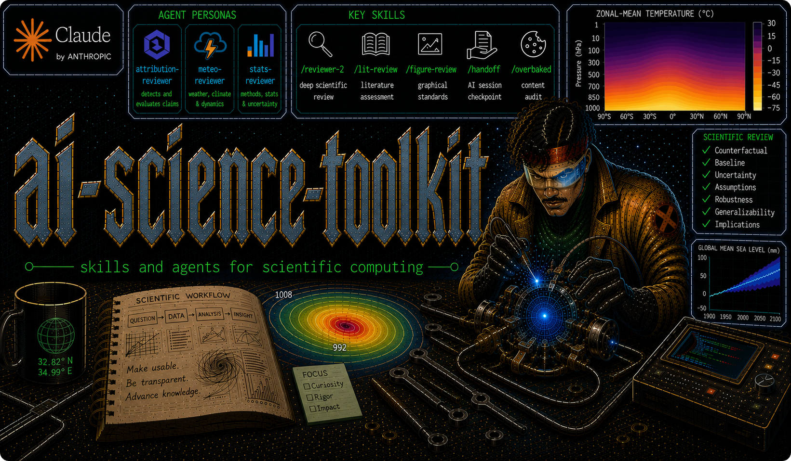

# ai-science-toolkit

A toolkit for AI-assisted scientific computing: [Claude Code](https://claude.com/claude-code) skills, domain-expert reviewer agents, and shell utilities — adopt it wholesale or grab single pieces.

## Installation

### As a plugin (one line)

If you use Claude Code's plugin system, add this repo as a marketplace and install the bundle:

```
/plugin marketplace add dgilford/ai-science-toolkit
/plugin install ai-science-toolkit@ai-science-toolkit
```

This installs every skill and reviewer agent. Updates come via `/plugin marketplace update ai-science-toolkit`. To cherry-pick individual pieces or register the session-naming boot hook, use the `sync.sh` workflow below.

### With `sync.sh` (clone and deploy)

Clone the repo, then deploy everything:

```bash
git clone https://github.com/dgilford/ai-science-toolkit.git ~/Projects/ai-science-toolkit
cd ~/Projects/ai-science-toolkit
bash scripts/sync.sh push
```

`push` installs all skills to `~/.claude/skills/`, all agents to `~/.claude/agents/`, and registers the boot hook for session auto-naming ([docs/tab-setup.md](docs/tab-setup.md)).

### Just the pieces you want

Name any skills or agents and only those are installed:

```bash
bash scripts/sync.sh push figure-review reviewer-2 stats-reviewer
```

Names are auto-detected as skills or agents. Skills that invoke other skills bring them along automatically (e.g. `handoff` pulls in `worklog` and `evolve-claude-md`), and a named push never touches `~/.claude/settings.json` unless `tab-setup` is included.

Most of the toolkit needs zero configuration; the exceptions (Zotero write access, the Notion work journal, session-name generation) are covered in [docs/configuration.md](docs/configuration.md).

### Keeping in sync

`skills/` and `agents/` in the repo are the source of truth — edit there (or `git pull` updates), then re-run `push`. To go the other way and capture globally installed skills into the repo:

```bash
bash scripts/sync.sh pull   # ~/.claude/skills/ → skills/; ~/.claude/agents/ → agents/
```

After `pull`, review `git diff skills/ agents/` — it brings in every installed skill and agent, including ones not tracked here.

## Skills

Skills are slash commands and mid-task capabilities for Claude Code. Type `/pathfinder` for a guided map of when to reach for each.

<!-- gen-docs:skills:start (generated by scripts/gen-docs.sh from skills/*/SKILL.md catalog frontmatter — do not hand-edit) -->
| Skill | Command | Purpose |
|---|---|---|
| **ai-review** | `/ai-review` | Comprehensive senior-engineer repo review; orchestrates a parallel fan-out that delegates to code-review/security-review/unstale/overbaked/reviewer-2 and adds gap-hunting, grounded ideation, and prioritized synthesis. Report-only by default; `--fix` opts into HIGH-confidence unstale repairs. |
| **commit-batch** | `/commit-batch` | Batch the working tree into logical, single-concern commits, then commit and push if asked. Thin launcher for the model-invokable `commit-batching` core. |
| **commit-batching** | `/commit-batching` | Batch a dirty working tree into logical, single-concern commits (survey → group → stage by path → commit → push if asked) — the model-invokable core behind `/commit-batch`. |
| **evolve-claude-md** | `/evolve-claude-md` | Update CLAUDE.md — or the canonical AGENTS.md it redirects to — with durable knowledge from the current session. |
| **figure-review** | `/figure-review` | Audit a scientific figure for publication-readiness: colormaps, uncertainty, axis labels, caption completeness, and claim support; `--style` adds CC house style. |
| **[grill-me](https://github.com/mattpocock/skills/tree/main/skills/productivity/grill-me)** | `/grill-me` | Interview the user relentlessly about a plan or design until reaching shared understanding, resolving each branch of the decision tree. Thin launcher for the model-invokable `grilling` core. By [Matt Pocock](https://github.com/mattpocock). |
| **[grilling](https://github.com/mattpocock/skills/tree/main/skills/productivity/grilling)** | `/grilling` | Grill the user relentlessly about a plan or design, one decision at a time, until shared understanding — the model-invokable core behind `/grill-me`. Adapted from [Matt Pocock](https://github.com/mattpocock). |
| **handoff** | `/handoff` | Create or update a durable project handoff (`.ai/HANDOFF.md`) for the next AI agent/session. |
| **lit-review** | `/lit-review` | Search and synthesize scientific literature from Zotero, arxiv, bioRxiv, Google Scholar, and Consensus. Zotero write support needs `ZOTERO_*` env vars in `~/.claude/settings.json`. |
| **overbaked** | `/overbaked` | Audit a document, plan, or code for over-engineering, verbosity, and scope creep. |
| **pathfinder** | `/pathfinder` | Router: a navigable map of every skill and subagent and when to reach for each; resolves the reviewer-2-vs-panel review decision. |
| **repo-init** | `/repo-init` | Scaffold a new repo (or retrofit an existing one) with a standard structure via a short intake grill: research mode by default, `--package` for a distributable library. Never overwrites; `--dry-run` previews. |
| **resume** | `/resume` | Resume work from repo-local handoff state. |
| **reviewer-2** | `/reviewer-2` | Adopt a critical-reviewer stance to stress-test a claim, result, or manuscript section: baseline, counterfactual, alternatives, uncertainty consistency. |
| **slack-message** | `/slack-message` | Draft an internal Slack message grounded in current project context and recent workflow. |
| **[tab-setup](https://github.com/JeraldHuff/tab-setup)** | `/tab-setup` | Assign a unique high-contrast color and name to the current Claude Code session; `all` recolors every active session. Forked from [Jerald Huff](https://github.com/JeraldHuff/tab-setup). |
| **unstale** | `/unstale` | Detect and repair staleness residue in Python library code and notebooks — dead imports, dead code, resolved TODOs, stale comments/docstrings, and HANDOFF blockers; `--auto` applies HIGH-confidence fixes. |
| **worklog** | `/worklog` | Log a work entry to the Notion Work Journal + remote server cache + local `.ai/` mirror — the capture core invoked by `/handoff` and whenever you ask to log something. |
| **write-new-skill** | `/write-new-skill` | Create new Claude Code skills with proper structure and progressive disclosure. |
<!-- gen-docs:skills:end -->

Some skills are user-invoked only (you type the slash command) while others Claude may reach for mid-task — see [CLAUDE.md](CLAUDE.md) for the invocation-control conventions.

## Agents

Subagent personas deploy to `~/.claude/agents/`. Each adopts a domain-expert reviewer stance — adversarial, ranked concerns, no rewriting — and they can run individually or as a parallel review panel.

<!-- gen-docs:agents:start (generated by scripts/gen-docs.sh from agents/*.md catalog frontmatter — do not hand-edit) -->
| Agent | Purpose |
|---|---|
| **attribution-reviewer** | Reviews climate-attribution claims for counterfactual, baseline, framing, uncertainty, model adequacy, and overclaiming |
| **stats-reviewer** | Reviews statistical analyses for estimator validity, causal identification, inference under dependence, model specification, multiple testing, and ML validity |
| **meteo-reviewer** | Reviews weather event analyses and atmospheric mechanism claims for dynamical, physical, observational, and hydrological rigor |
| **scicomm-reviewer** | Reviews public-facing science products for audience specificity, relevance framing, cognitive load, jargon, solutions/benefits, and uncertainty language ([COMPASS](https://www.compassscicomm.org/) principles) |
<!-- gen-docs:agents:end -->

## Listing running sessions (`ai-sessions`)

Beyond skills and agents, the toolkit ships shell utilities. `scripts/ai-sessions.sh` defines an `ai-sessions` function that lists your running Claude/Codex CLI sessions with their resume commands. Source it directly from the repo (no copy — `git pull` keeps it current) by adding to `~/.bashrc` (or `~/.zshrc`):

```bash
source ~/Projects/ai-science-toolkit/scripts/ai-sessions.sh
```

Run `ai-sessions` to list sessions. Claude's own recap (`away_summary`) is shown by default for each session.

## Session workflow

The handoff skills form a session lifecycle that keeps project state durable across sessions:

```
/resume            # start of session — loads handoff, reports state
/handoff           # end of session — writes handoff, updates CLAUDE.md
/evolve-claude-md  # anytime — promote new knowledge to CLAUDE.md
```

State lives in a repo-local `.ai/` directory — add it to `.gitignore` in any project where you use these skills.

## More documentation

- [docs/configuration.md](docs/configuration.md) — per-skill setup: env vars, connectors, and what degrades gracefully without them
- [docs/tab-setup.md](docs/tab-setup.md) — session auto-naming and color: startup reminders, machine-level config, uninstall
- [docs/repo-layout.md](docs/repo-layout.md) — what every file and directory in this repo is for
- [CLAUDE.md](CLAUDE.md) — skill-development conventions, sync internals, and repo workflow notes

## Citation

[](https://zenodo.org/doi/10.5281/zenodo.21461068)

If this toolkit supports your work, please cite it. GitHub's "Cite this repository" button reads [`CITATION.cff`](CITATION.cff) and generates APA/BibTeX for the specific release, while the DOI badge above (the Zenodo concept DOI) always resolves to the latest archived version.

## License

Released under the [MIT License](LICENSE) — Copyright (c) 2026 Daniel Gilford.
